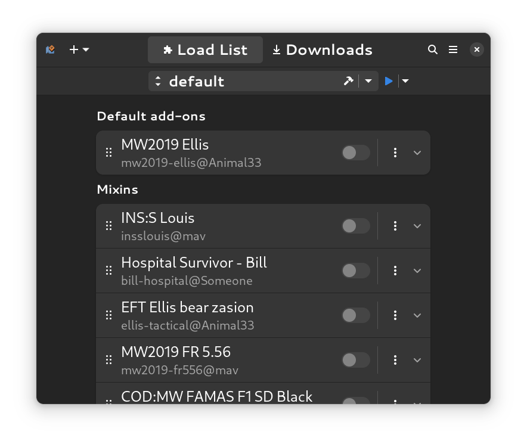

<div align="center">

<br />
<h1>Add-on Box</h1>
Add-on manager for Left 4 Dead 2
<br />
</div>
<div align="center">

</div>
<br />

### Install with GNOME Builder

GNOME Builder is the environment used for developing this application. It can use Flatpak manifests to create a consistent building and running environment cross-distro. Thus, it is highly recommended you use it.

1. Download [GNOME Builder](https://flathub.org/apps/details/org.gnome.Builder).
2. In Builder, click the "Clone Repository" button at the bottom, using `https://github.com/kinten108101/steam-vpk.git` as the URL.
3. Click on the popdown button next to build button. Verify that "manifest.json" is the Active Configuration.
3. Click the build button at the top once the project is loaded.

### Install with Flatpak Builder

`flatpak-builder` is a wrapper around the `flatpak build` command that automates the building of applications and their dependencies. It uses Flatpak manifests to download and pack needed dependencies with compiled program into a single Flatpak image that can be later distributed or installed on your system. We recommend this method if you have problems with GNOME Builder.

Make sure you have Flatpak and Flatpak Builder installed on your computer. Also make sure you've downloaded the runtimes.

```shell
flatpak install org.gnome.Platform//44 org.gnome.Sdk//44 org.freedesktop.Sdk.Extension.node18//22.08
```

Then clone this repository to your computer, pulling all submodules with the `--recurse-submodules` flag.

```shell
git clone https://github.com/kinten108101/steam-vpk.git --recurse-submodules
```

Then run `flatpak-builder` with the application manifest inside `/build-aux`.

```shell
flatpak-builder --force-clean --user --install build build-aux/com.github.kinten108101.SteamVpk.yml
```

### Install with Meson

Dependencies:

- meson ^0.63.0
- yarn ^1.22.19
- gjs ^1.76.0
- gtk4 ^4.10.3
- libadwaita ^1.3.3
- libsoup ^3.4.2
- libpanel ^1.1.0 (https://gitlab.gnome.org/GNOME/libpanel)
- blueprint-compiler ^0.8.0 (https://gitlab.gnome.org/jwestman/blueprint-compiler)
- glib-compile-schemas

Clone the repository as above. Then run these commands at this directory:

```shell
yarn install
meson configure _build
sudo meson install -C _build
```
