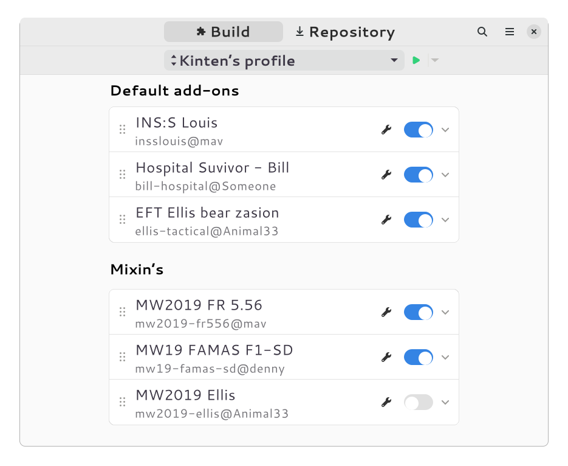

# Steam VPK

Add-on manager for Left 4 Dead 2



## Installation

Currently, there is no stable build for this project.

## Development

Require [gtk](https://gitlab.gnome.org/GNOME/gtk) (version 4), [libadwaita](https://gitlab.gnome.org/GNOME/libadwaita), and [libpanel](https://gitlab.gnome.org/GNOME/libpanel)

### Using yarn

Require [yarn](https://yarnpkg.com/getting-started)

Install development dependencies:

```sh
yarn install
```

Generate type definition from GIR files of libaries (libadwaita, libpanel):

```sh
yarn run build:types
```

Build and run project:

```sh
yarn run dev
```

### Using GNOME Builder

> To be added

## License

GPLv3 or later. See [LICENSE](LICENSE).
