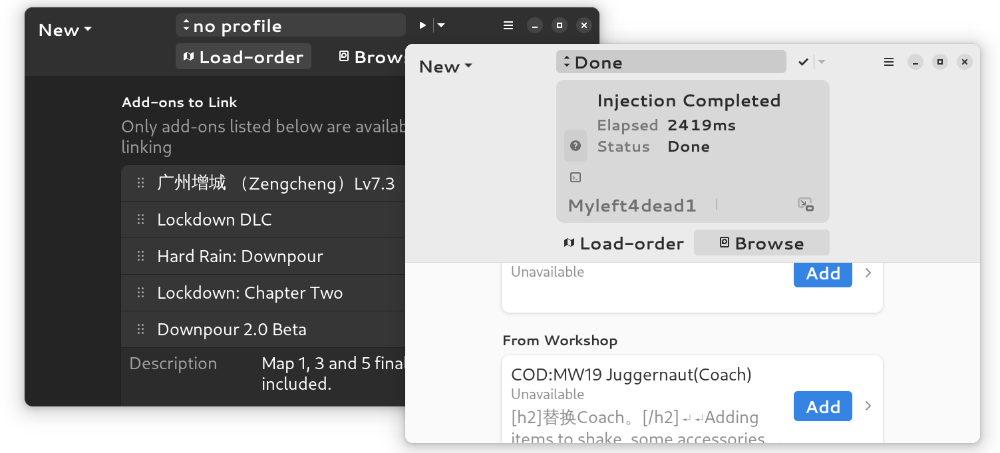

<div align="center">

<br />
<h1>Steam VPK</h1>
<p></p>Add-on manager for Left 4 Dead 2<br /></p>
</div>
<div align="center">

</div>
<br />

This application is under development - not ready for practical usage. Any feedback, contribution, or feature request is greatly appreciated!

### Install with GNOME Builder

1. Download [GNOME Builder](https://flathub.org/apps/details/org.gnome.Builder).
2. In Builder, click the "Clone Repository" button at the bottom, using `https://github.com/kinten108101/addon-box.git` as the URL.
3. Click on the popdown button next to build button. Verify that "manifest.json" is the Active Configuration.
3. Click the build button at the top once the project is loaded.

### Install with Flatpak Builder

Download the necessary runtime, SDK, and extension for Flatpak:

```shell
flatpak install org.gnome.Platform//44 org.gnome.Sdk//44 org.freedesktop.Sdk.Extension.node18//22.08
```

Then run the builder tool:

```shell
flatpak-builder --force-clean --user --install build build-aux/com.github.kinten108101.SteamVPK.yml
```

### Install with Meson

Dependencies:

- meson
- yarn
- gjs ^1.76.0
- gtk4 ^4.10.3
- libadwaita ^1.3.3
- blueprint-compiler ^0.8.1 (https://gitlab.gnome.org/jwestman/blueprint-compiler)
- glib-compile-schemas

Clone the repository as above. Then run these commands at this directory:

```shell
yarn install
meson configure build-meson
sudo meson install -C build-meson
```
